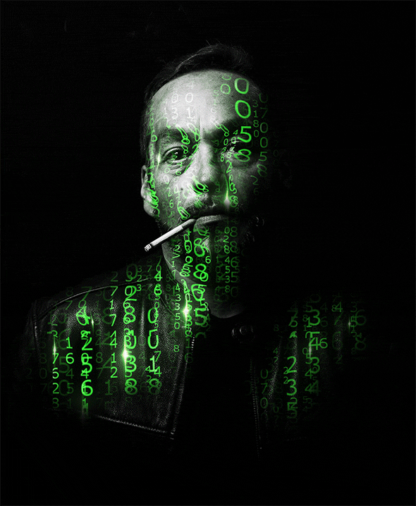

    <table>
        <td align = "center">
            <h1 color = "green" >
                $\color{rgb(18,95,43)}{\textsf{Welcome to the my Hub!}}$
            </h1>
            
<i>«The more experienced a programmer is, the more he is aware of the scarcity of his knowledge and skills»</i>

            
© Chris Hughes

        </td>
        <td>
            
        </td>
    </table>

 

    <h2>$\color{rgb(18,95,43)}{\textsf{ABOUT ME}}$</h2>
    <ul>
        <li>🌏 I`m Frontend developer from Moscow, Russia</li>
        <li>💻 Developing in frontend development for over 2 years</li>
        <li>⌨ Basic technology stack: TypeScript/React/Redux/SCSS</li>
    </ul>

